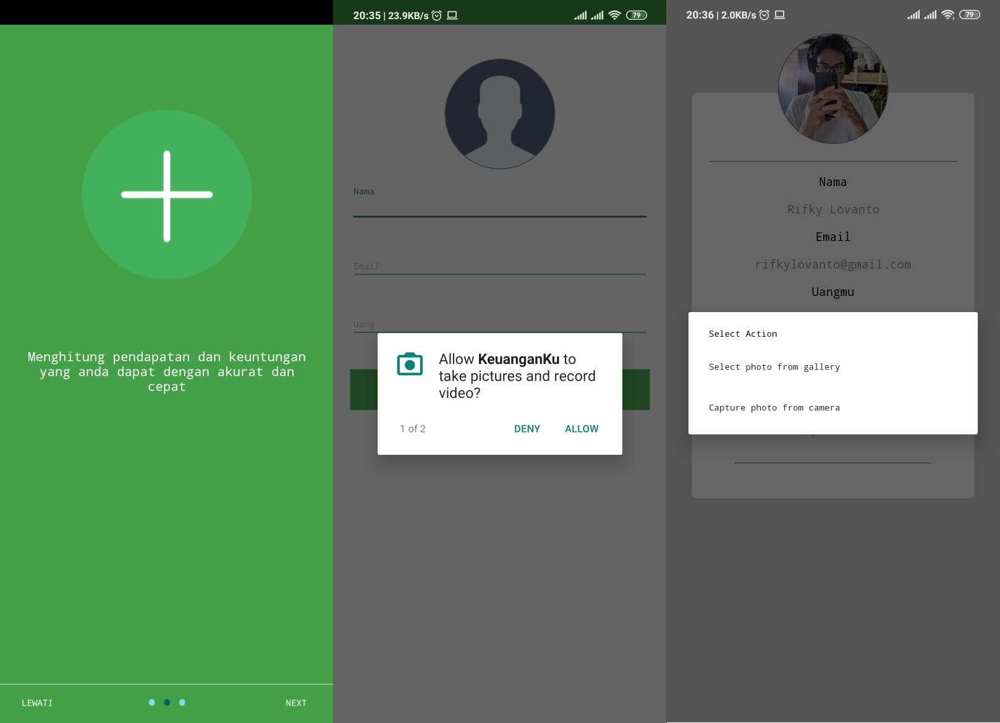
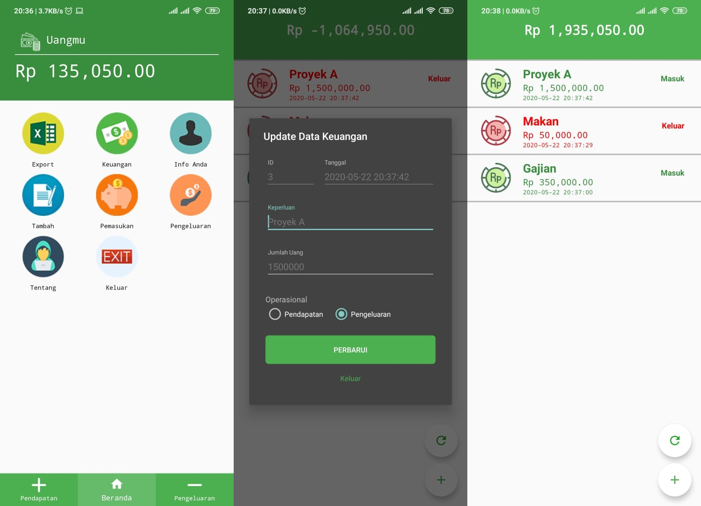

# Money Management Apps / Keuanganku

## Description

This application is used to record expenses and income using their smartphone and store it in sqlite so that it can run offline and can also be converted to Excel if needed. I made this application to meet the graduation requirements at the vocational high school.

## Fitures

 1. Splash Screen
 2. Intro Screen
 3. Add, Edit, and Delete (SQLite)
 4. Export to Excel
 5. Access Camera, internet, Write and Read Storange for Profile

## How To Run Using Desktop
 1. Download this repo or clone this repo using `git clone https://github.com/lovanto/money-management-apps.git`
 2. Open it using android studio (Prefer android studio 3)
 3. Click Shift+F10

## How To Run Using Android Phone
 1. Download the Keuanganku.apk
 2. Install it
 3. Run it

## Notes
Use this program as a reference not for plagiarism.